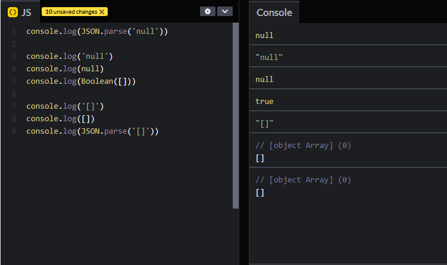

# React Shopping Cart

This is a [tutorial](https://www.youtube.com/watch?v=lATafp15HWA) project from [Web Dev Simplified](https://www.youtube.com/@WebDevSimplified) on YouTube.

## The challenge

Users should be able to:

- Show and hide the cart
- Add items to the cart and remove them
- Increase and decrease the quantity of the items in the cart
- See subtotals of the items according to their quantity
- See the total price

## Screenshot


## Links

- [View Code](https://github.com/elizerdim/react-shopping-cart)
- [Live Preview](https://react-shopping-cart-iota-three.vercel.app/)

## Built with

- React
- TypeScript
- React Router
- React Bootstrap

## What I learned

- ```useContext()```
- React Bootstrap
- Intl.NumberFormat built-in JS object (see Useful resources section for MDN link)
- ```JSON.parse()``` can actually return code. I hadn't noticed this before, but passing ```'[]'``` to JSON.parse will actually return an empty array or passing ```'null'``` will return JavaScript datatype ```null```. So I used the following code to resolve the TypeScript error saying that JSON.parse() cannot take ```null``` as an argument if the storage is empty:
  ```js
  JSON.parse(localStorage.getItem("cart") || '[]')
  ```
  This is also a modification I made to the original code in the tutorial instead of using the hook explained at the end.

  examples (codepen snippet):
  

## Continued development

Learning all React hooks!

## Useful resources

- [React Bootstrap](https://react-bootstrap.github.io/docs/getting-started/introduction) - Documentation for React Bootstrap
- [```Intl.NumberFormat``` object (MDN)](https://developer.mozilla.org/en-US/docs/Web/JavaScript/Reference/Global_Objects/Intl/NumberFormat) - "The Intl.NumberFormat object enables language-sensitive number formatting." (also see [Beyond Fireship's video](https://www.youtube.com/watch?v=FUngCjDzFDo) from YouTube because he makes it more fun and [Web Dev Simplified's video](https://www.youtube.com/watch?v=4oGWpTAY_hc) because he goes into more depth)
- [useContext introduction video](https://www.youtube.com/watch?v=_HdrLsyAdJg) - 2min. video with a very basic introduction to useContext hook
- [useContext detailed video](https://www.youtube.com/watch?v=5LrDIWkK_Bc&t=191s) - more in-depth explanation of useContext by Web Dev Simplified
- [stack overflow entry about JSON.parse error](https://stackoverflow.com/questions/54715260/typescript-json-parse-error-type-null-is-not-assignable-to-type-string) - This entry is about the TypeScript error when JSON.parse() is used with an empty localStorage because it doesn't accept ```null``` as an argument.